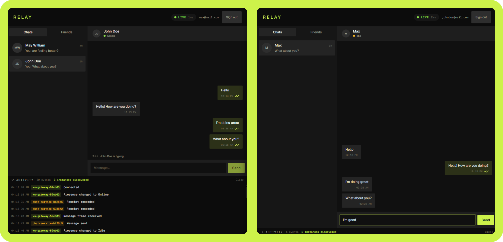
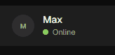
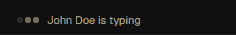
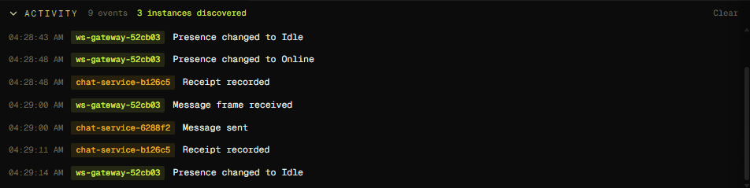
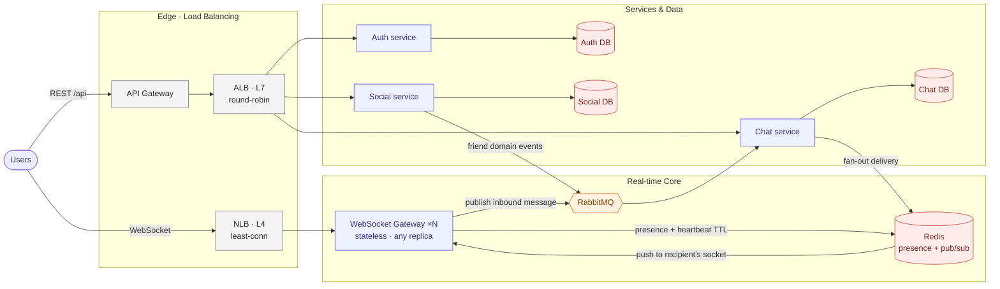
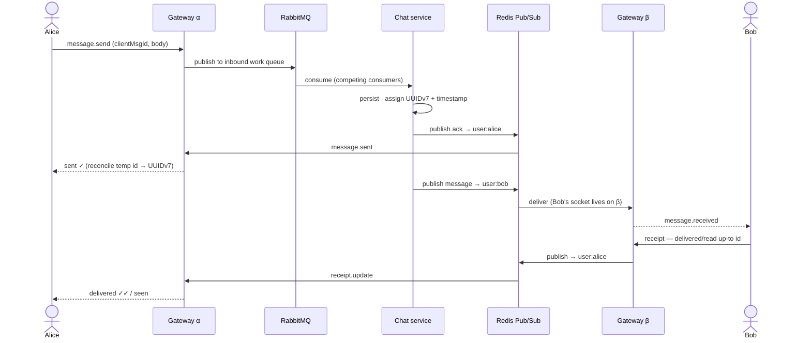

<p align="center">
  
</p>

<p align="center">
  A horizontally-scalable real-time chat
  <br />
</p>

<p align="center">
  
  
  
  
  
  
  
  
</p>

<p align="center">
  
</p>

<p align="center">
  <em>1:1 messaging · delivery &amp; read receipts · focus-driven presence · typing · reconnect &amp; resync — across N gateway replicas.</em>
</p>

> Exploring how a WebSocket connection that lives on **one** server instance can still
> reach a user connected to a **different** one — the core problem of running real-time
> chat behind more than one box.

---

## Contents

- [Why this exists](#why-this-exists)
- [Feature tour](#feature-tour)
- [Architecture](#architecture)
- [The life of a message](#the-life-of-a-message)
- [Horizontal scaling](#horizontal-scaling)
- [Tech stack](#tech-stack)
- [Running it](#running-it)
- [Project layout](#project-layout)
- [Further reading](#further-reading)

---

## Why this exists

A single chat server is easy: every socket is in the same process, so delivering a message
is a local lookup. The moment you run **two** gateways behind a load balancer, that
assumption breaks — the sender's socket is on gateway α, the recipient's is on gateway β,
and neither can see the other's connections.

Relay is a deliberately small (1:1 only) but **fully horizontally-scaled** chat that solves
exactly that distributed real-time path:

- **Stateless gateways** — a client may land on any replica and simply re-register; no
  sticky sessions.
- **Cross-instance delivery** over Redis Pub/Sub — the gateway holding the recipient's
  socket gets the message, wherever it lives.
- **An async send path** — clients publish to a RabbitMQ work queue that the chat service
  consumes with competing consumers, so message persistence scales independently of the
  socket layer.
- **Presence, receipts, typing, and reconnect/resync** all designed to survive replicas
  coming and going.

Group chat, message edit/delete, and search are intentionally out of scope — see
[`REQUIREMENTS.md`](./REQUIREMENTS.md) for the full scoped spec and the conscious
non-goals.

---

## Feature tour

| | |
|---|---|
| **Receipts** — `sent → delivered → seen`, each checkmark computed locally from per-conversation high-water marks. |  |
| **Presence** — focus-driven `online / idle / offline` (a live socket alone isn't "online"), with multi-device precedence. |  |
| **Typing** — a debounced, ephemeral signal with a timeout fallback. |  |

Plus optimistic **messaging** with durable UUIDv7-ordered history, and **reconnect &
resync** (backoff + jitter, cursor catch-up, dedupe by id) — see
[Architecture](#architecture) and [`REQUIREMENTS.md`](./REQUIREMENTS.md).

### Watch it scale

Every event is tagged with the **replica that handled it**, so sending a few messages or
refreshing a token visibly lands on different instances — the whole point of the project:

<p align="center">
  
</p>

---

## Architecture

The diagram shows the intended **cloud** topology: an L4 **NLB** for long-lived
WebSockets, an L7 **ALB** for stateless HTTP, a pool of WebSocket gateways, and the
real-time core (Redis + RabbitMQ) wiring it all together.



> **Cloud-idiomatic, simulated locally.** For study purposes the repo collapses the NLB +
> API Gateway + ALB into a **single nginx** edge that plays both roles — L7 routing for
> `/auth /social /chat` (Docker-DNS round-robin) and an L4-style `least_conn` upstream for
> `/ws` — and every tier scales with `docker compose --scale`, with the instance ids
> surfacing live in the app's Activity log.

**The pieces:**

| Component | Role |
|---|---|
| **WebSocket gateway** (Go) | Terminates client sockets, runs first-frame JWT auth, heartbeat, presence, and the inbound/outbound message bridge. Stateless and replicated. |
| **Auth service** | Issues & verifies JWTs, owns users + refresh tokens. The gateway verifies the *same* token locally (shared secret) — no per-message call to auth. |
| **Social service** | Friend requests & friendships; emits domain events to RabbitMQ and pushes live list updates via Redis. |
| **Chat service** | Consumes the inbound work queue + friend events; owns conversations/messages and the friends read-model; serves history. |
| **Redis** | Presence registry (with heartbeat TTL) **and** per-user Pub/Sub delivery channels. |
| **RabbitMQ** | The inbound message work queue (competing consumers) + the `domain.events` topic exchange. |
| **nginx** | The single local edge that stands in for the NLB/ALB split. |

---

## The life of a message

The headline mechanic: Alice and Bob are on **different gateways**, yet the message (and
the receipt that flows back) reaches the right socket via Redis Pub/Sub.



Key ideas:

- **Server-assigned UUIDv7** ids are time-sortable, so they double as the ordering key
  *and* the resync cursor — no separate sequence column.
- **Receipts are high-water marks** (`delivered_up_to` / `read_up_to`), not per-message
  rows. The sender's client computes every checkmark locally; advancing a mark is `max()`,
  so retries are idempotent.
- **Offline?** The message is durably stored and delivered on reconnect via a
  `GET messages since {cursor}` catch-up, deduped by id against any live push.

See [`REQUIREMENTS.md`](./REQUIREMENTS.md) §3–§8 for the full model (receipts, presence
precedence, reconnect/resync).

---

## Horizontal scaling

This is the whole point — bring up multiple replicas per tier and watch the work spread:

```bash
docker compose up -d --build --force-recreate \
  --scale auth-service=2 --scale social-service=2 \
  --scale chat-service=2 --scale ws-gateway-go=2
```

Each replica derives a distinct instance id from its container hostname, surfaced in the
client's **Activity log** — so sending a few messages or refreshing a token visibly lands
on different replicas.

How each tier balances:

- **HTTP tiers** (`/auth /social /chat`) — nginx re-resolves the service name via Docker
  DNS *per request*, naturally round-robining across replica A-records (and following
  containers that get a new IP on rebuild).
- **WebSocket gateways** (`/ws`) — a `least_conn` upstream, because long-lived connections
  are uneven; balancing by active-connection count beats round-robin.
- **Message persistence** — RabbitMQ competing consumers across chat-service replicas.
- **Cross-instance delivery** — Redis Pub/Sub, so location is a lookup, not a fixed
  assignment.

> ⚠️ `--scale` is **not** persisted — pass the flags on *every* `docker compose up`, or it
> reverts to one replica each. Bring the gateway replicas up together (nginx resolves the
> `least_conn` pool once at boot); if you rebuild a gateway replica afterwards, recreate
> nginx: `docker compose up -d --force-recreate --no-deps nginx`.

---

## Tech stack

| Layer | Tech |
|---|---|
| **Client** | React 19, Vite, TanStack Router + Query, Tailwind v4 (the "Relay" SPA) |
| **WebSocket gateway** | Go · gorilla/websocket |
| **Services** | Node.js + TypeScript, Drizzle ORM |
| **Data** | PostgreSQL 16 · Redis 7 · RabbitMQ 3.13 |
| **Edge** | nginx |
| **Tooling** | pnpm workspaces · Turborepo · Docker Compose |

---

## Running it

Copy `.env.example` to `.env` (it must set `JWT_SECRET`), then bring up the stack.

```bash
# Single instance per tier
docker compose up -d --build

# Scaled — multiple replicas per tier (see them in the client's Activity log)
docker compose up -d --build --force-recreate \
  --scale auth-service=2 --scale social-service=2 \
  --scale chat-service=2 --scale ws-gateway-go=2
```

Then open the web client:

- **Containerized:** http://localhost:3000 — the `web` service (nginx serving the SPA and
  proxying `/api` to the edge).
- **Dev server (hot reload):** `pnpm --filter @hsc/web dev` → http://localhost:5173

---

## Project layout

```
apps/
  web/             Relay SPA (React) + its Dockerfile/nginx front door
  ws-gateway-go/   WebSocket gateway (Go)
services/
  auth-service/    identity — JWTs, users, refresh tokens
  social-service/  friends — requests, friendships, domain events
  chat-service/    messaging — conversations, messages, history
packages/
  platform/        shared TypeScript (instance id, log stream, …)
infra/
  nginx/           edge + web front-door configs
docker-compose.yml
REQUIREMENTS.md    the scoped functional spec
```

---

## Further reading

- [`REQUIREMENTS.md`](./REQUIREMENTS.md) — the full functional spec: the receipt
  high-water-mark model, presence precedence, and the reconnect/resync contract, plus the
  conscious v1 non-goals.
